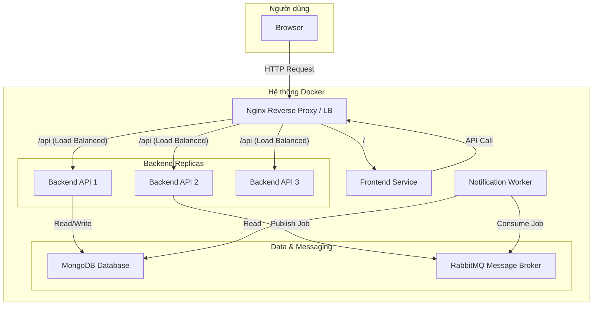

# Nền tảng Cho thuê đồ dùng cá nhân P2P (P2P Rental Platform)

Đây là dự án giữa kỳ cho môn học Lập trình Web với NodeJS (502070). Dự án xây dựng một nền tảng kinh tế chia sẻ (MVP) cho phép người dùng cho thuê và đi thuê các vật dụng cá nhân một cách an toàn và tiện lợi. Hệ thống được xây dựng trên kiến trúc microservices, có khả năng mở rộng và được điều phối bởi Docker Compose và Docker Swarm.

## ✨ Tính năng chính

- ✅ **Xác thực & Phân quyền:** Đăng ký, Đăng nhập, Đăng xuất.
- 🖼️ **Quản lý Vật phẩm (CRUD):** Người dùng có thể đăng tải, xem danh sách, cập nhật và xóa các vật phẩm cá nhân cho thuê.
- 🔍 **Tìm kiếm & Khám phá:** Tìm kiếm vật phẩm theo tên, xem các vật phẩm mới nhất.
- 📅 **Luồng Đặt thuê hoàn chỉnh:** Xem lịch trống, gửi yêu cầu, Chấp nhận/Từ chối yêu cầu, theo dõi trạng thái.
-  📧 **Thông báo bất đồng bộ qua Email:** Tự động gửi email cho chủ sở hữu và người thuê khi có cập nhật trạng thái đơn hàng. Tác vụ này được xử lý bất đồng bộ qua RabbitMQ và một Worker riêng biệt để không làm ảnh hưởng đến hiệu năng của hệ thống.

## 🛠️ Công nghệ sử dụng

| Lĩnh vực | Công nghệ |
| :--- | :--- |
| **Frontend** |  |
| **Backend** |   |
| **Database** |  |
| **Message Broker** |  |
| **Containerization** |  |
| **Reverse Proxy / LB**|  |
| **Orchestration** | Docker Swarm |

## 🏗️ Kiến trúc Hệ thống

Dự án được xây dựng theo kiến trúc microservices có khả năng mở rộng. Nginx đóng vai trò là cổng vào duy nhất (Reverse Proxy) và cân bằng tải (Load Balancer) cho các service backend. RabbitMQ được sử dụng để tách biệt (decouple) logic thông báo khỏi luồng xử lý chính, giúp tăng tính ổn định và khả năng phục hồi của hệ thống.



## 🚀 Hướng dẫn Cài đặt và Chạy dự án

### Yêu cầu tiên quyết
- [Git](https://git-scm.com/)
- [Docker](https://www.docker.com/products/docker-desktop/) và Docker Compose

### Cấu hình
1.  **Clone repository:**
    ```bash
    git clone <your-repo-url>
    cd <repo-folder>
    ```

2.  **Thiết lập biến môi trường:**
    Sao chép các file `.env.example` thành `.env` và chỉnh sửa nếu cần thiết.
    ```bash
    # Cho Backend
    cp backend/.env.example backend/.env

    # Cho Frontend
    cp frontend/.env.example frontend/.env

    # Cho Notification Worker
    cp notification-worker/.env.example notification-worker/.env
    ```
    **Lưu ý quan trọng:** Cần điền thông tin SMTP của bạn vào `notification-worker/.env` để tính năng gửi email hoạt động.

---

### Chạy ở Môi trường Phát triển (Tương đương Level 2)

Môi trường này hỗ trợ live-reload code và scaling với Docker Compose, phù hợp cho việc phát triển và demo Level 2.

1.  **Khởi chạy hệ thống:**
    ```bash
    # Khởi chạy toàn bộ service, đồng thời tạo 3 bản sao của backend
    docker-compose up --build --scale backend=3 -d
    ```

2.  **Truy cập:**
    -   **Ứng dụng Web:** [http://localhost](http://localhost)
    -   **Giao diện RabbitMQ:** [http://localhost:15672](http://localhost:15672) (user: `guest`, pass: `guest`)

3.  **Dừng hệ thống:**
    ```bash
    docker-compose down
    ```

---

### Chạy ở Môi trường Triển khai (Tương đương Level 3 với Docker Swarm)

Môi trường này mô phỏng việc triển khai ứng dụng lên một cluster, đáp ứng yêu cầu của Level 3.

1.  **Khởi tạo Swarm (chỉ làm 1 lần):**
    ```bash
    docker swarm init
    ```

2.  **Build các image production:**
    Lệnh này sử dụng file `docker-compose.yml` để xây dựng các image cần thiết.
    ```bash
    docker-compose build
    ```

3.  **Triển khai "stack" lên Swarm:**
    Lệnh này sử dụng file `docker-compose.swarm.yml` để triển khai các image đã được build.
    ```bash
    docker stack deploy -c docker-compose.swarm.yml p2p_rental_stack
    ```

4.  **Kiểm tra trạng thái:**
    ```bash
    docker service ls
    ```
    Đợi cho đến khi cột `REPLICAS` của tất cả các service hiển thị đúng số lượng (ví dụ: `3/3`).

5.  **Truy cập:**
    -   **Ứng dụng Web:** [http://localhost](http://localhost)

6.  **Dừng và dọn dẹp:**
    ```bash
    docker stack rm p2p_rental_stack
    docker swarm leave --force
    ```

---

## 👥 Thành viên Nhóm

| STT | Họ và Tên               | MSSV     |
|:----|:------------------------|:---------|
| 1   | Thân Quốc Thịnh          | 52200112 |
| 2   | Châu Nguyễn Khánh Trình | 52200005 |

- **Học kỳ:** 1 - Năm học 2025-2026
