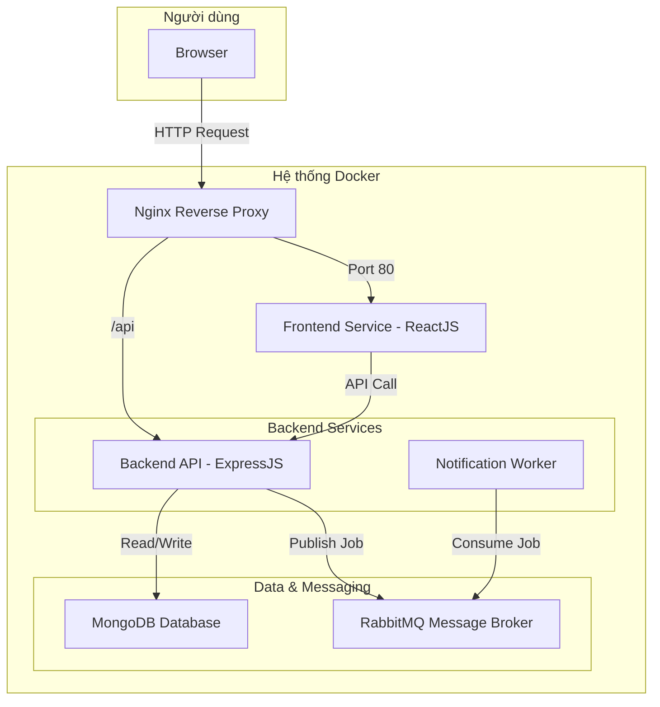

# Nền tảng Cho thuê đồ dùng cá nhân P2P (P2P Rental Platform)

Đây là dự án giữa kỳ cho môn học Lập trình Web với NodeJS (502070). Dự án xây dựng một nền tảng kinh tế chia sẻ (MVP) cho phép người dùng cho thuê và đi thuê các vật dụng cá nhân một cách an toàn và tiện lợi, được xây dựng trên kiến trúc microservices và triển khai bằng Docker.

## ✨ Tính năng chính

### Dành cho Người dùng (User)
- ✅ **Xác thực:** Đăng ký, Đăng nhập, Đăng xuất bằng tài khoản Email.
- 🖼️ **Quản lý Vật phẩm:** Đăng tải, xem danh sách, chỉnh sửa và xóa các vật phẩm cá nhân cho thuê.
- 🔍 **Tìm kiếm & Khám phá:** Tìm kiếm vật phẩm theo tên và xem các vật phẩm mới nhất trên trang chủ.
- 📅 **Luồng Đặt thuê:**
    - Xem chi tiết thông tin vật phẩm và lịch trống.
    - Gửi yêu cầu thuê với khoảng thời gian cụ thể.
    - Chủ sở hữu có thể Chấp nhận hoặc Từ chối yêu cầu.
    - Theo dõi trạng thái tất cả các đơn thuê (cả đi thuê và cho thuê).
-  asynchronously **Thông báo:** Nhận thông báo qua email (mô phỏng) khi có các cập nhật quan trọng về đơn thuê (được xử lý bất đồng bộ qua RabbitMQ).

### Dành cho Quản trị viên (Admin)
- 👤 **Quản lý Người dùng:** Xem danh sách và khóa/mở khóa tài khoản người dùng.
- 📦 **Quản lý Vật phẩm:** Duyệt và gỡ các bài đăng vi phạm chính sách.

## 🛠️ Công nghệ sử dụng

| Lĩnh vực | Công nghệ |
| :--- | :--- |
| **Frontend** |  |
| **Backend** |   |
| **Database** |  |
| **Message Broker** |  |
| **Containerization** |  |
| **Web Server / Proxy**|  |

## 🏗️ Kiến trúc Hệ thống

Dự án được xây dựng theo kiến trúc microservices, được điều phối bởi Docker Compose.



## 🚀 Hướng dẫn Cài đặt và Chạy dự án

### Yêu cầu tiên quyết
- [Git](https://git-scm.com/)
- [Docker](https://www.docker.com/products/docker-desktop/)
- Một trình soạn thảo code, ví dụ [Visual Studio Code](https://code.visualstudio.com/)

### Các bước cài đặt

1.  **Clone repository về máy:**
    ```bash
    git clone https://your-repo-url/p2p-rental-platform.git
    cd p2p-rental-platform
    ```

2.  **Cấu hình biến môi trường:**
    Dự án cần các file `.env` để hoạt động. Hãy tạo chúng bằng cách sao chép từ các file `.env.example`.

    *   **Đối với Backend:**
        ```bash
        cp backend/.env.example backend/.env
        ```
        Sau đó mở file `backend/.env` và chỉnh sửa các giá trị nếu cần (giá trị mặc định đã được cấu hình để chạy với Docker).
        ```env
        # backend/.env
        PORT=5000
        MONGO_URI=mongodb://mongodb:27017/p2p_rental
        JWT_SECRET=YOUR_SUPER_SECRET_KEY
        RABBITMQ_URL=amqp://rabbitmq
        ```

    *   **Đối với Frontend:**
        ```bash
        cp frontend/.env.example frontend/.env
        ```
        File này giúp React biết địa chỉ API của backend.
        ```env
        # frontend/.env
        REACT_APP_API_URL=http://localhost/api
        ```

3.  **Khởi chạy toàn bộ hệ thống bằng Docker Compose:**
    Mở terminal ở thư mục **gốc** của dự án (`p2p-rental-platform/`) và chạy lệnh sau:
    ```bash
    docker-compose up -d --build
    ```
    - `--build`: Sẽ build lại các image nếu có thay đổi trong source code.
    - `-d`: Chạy các container ở chế độ detached (chạy ngầm).

4.  **Hệ thống đã sẵn sàng!**
    - 🌐 **Truy cập ứng dụng Web:** [http://localhost](http://localhost) (Nginx sẽ tự động trỏ đến port 80)
    - 📄 **Truy cập tài liệu API (Swagger):** [http://localhost:5000/api-docs](http://localhost:5000/api-docs)
    - 🐰 **Truy cập giao diện quản lý RabbitMQ:** [http://localhost:15672](http://localhost:15672) (user: `guest`, pass: `guest`)

### Dừng hệ thống

Để dừng tất cả các container đang chạy, sử dụng lệnh:
```bash
docker-compose down
```

---

## 👥 Thành viên Nhóm

| STT | Họ và Tên | MSSV |
| :--- | :--- | :--- |
| 1 | Thân Quốc Thịnh | 52200112 |
| 2 | Châu Nguyễn Khánh Trình | 52200005 |

- **Học kỳ:** 1 - Năm học 2025-2026


